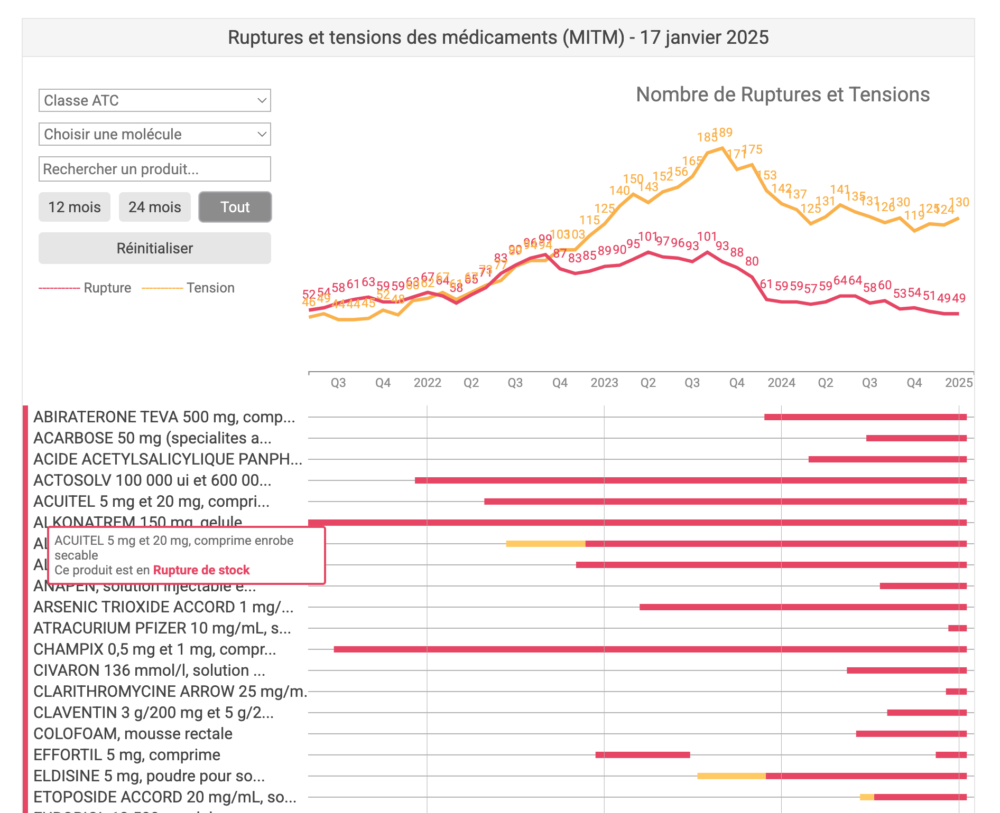

# Dispomed / Dr Kevin

# Pharmaceutical Product Availability Dashboard

## Concept
This project aims to provide better transparency and information in public health, specifically regarding medication availability. By offering clear and accessible data, we contribute to improving public health information and decision-making.

## Overview
This project is a visual dashboard that tracks the availability of pharmaceutical products over time. It provides a clear, color-coded representation of product status across multiple years, allowing for easy identification of supply trends and potential shortages.



## Features
- **Time-based Visualization**: The dashboard displays product availability from 2021 to 2024, broken down by months.
- **Color Coding**:
  - Red: Indicates a supply rupture or significant shortage
  - Yellow: Represents a tension in the supply chain
- **Product Search**: Users can search for specific products using the search bar at the top of the dashboard.

## Data Representation
- Each row represents a different pharmaceutical product.
- Columns are divided by year and month.
- Cells are color-coded to indicate the status of each product for a given month.
- Numbers in the cells may represent specific stock levels or status codes.

## Usage
1. Browse the list of products on the left side of the dashboard.
2. Use the search bar to find specific products quickly.

## Technical Details
This dashboard is built using D3.js for visualization.

## Future Enhancements
- Interactive tooltips for detailed information on hover
- Filtering options by product category or status
- Data export functionality
- Historical data analysis and predictive supply forecasting

## Development Setup

### Database Setup
After cloning or migrating the project, follow these steps to set up the database:

1. Make sure PostgreSQL is installed and running on your machine.
2. Create a new database named `dispomed`:
   ```
   createdb dispomed
   ```
3. Create a `.env` file in the project root with the following content:
   ```
   DATABASE_URL=postgres://localhost:5432/dispomed
   ```
   Note: Adjust the connection string if your PostgreSQL setup requires a username/password.
4. Initialize the database schema:
   ```
   npm run init-db
   ```

### Running the Application
1. Install dependencies:
   ```
   npm install
   ```
2. Start the application:
   ```
   npm start
   ```
3. Access the application at http://localhost:3000
